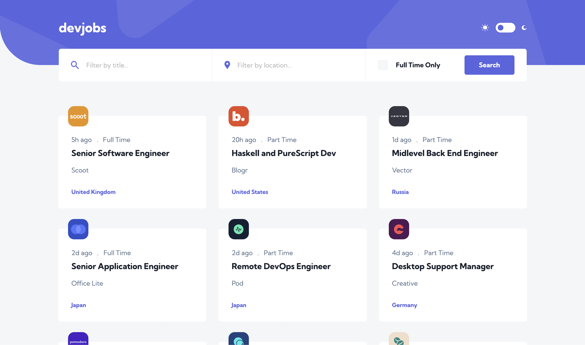

# Frontend Mentor - Devjobs web app solution

This is a solution to the [Devjobs web app challenge on Frontend Mentor](https://www.frontendmentor.io/challenges/devjobs-web-app-HuvC_LP4l). Frontend Mentor challenges help you improve your coding skills by building realistic projects.

## Overview
This is my solution to the Devjobs web app challenge on Frontend Mentor, this is builded with React Js, Sass, React-Responsive-Modal, React Router Dom.

### The challenge

Users should be able to:

- View the optimal layout for each page depending on their device's screen size
- See hover states for all interactive elements throughout the site
- Be able to filter jobs on the index page by title, location, and whether a job is for a full-time position
- Be able to click a job from the index page so that they can read more information and apply for the job

- **Bonus**: Have the correct color scheme chosen for them based on their computer preferences by checking `prefers-color-scheme` value and setSwitchTheme based on the value checked.
### Screenshot

### Links

- Solution URL: [Add solution URL here](https://github.com/khach2010/Devjobs-web-app-challenge)
- Live Site URL: [Add live site URL here](https://devjobs-web-app-challenge.netlify.app)

## My process

### Built with

- Semantic HTML5 markup
- CSS custom properties
- Flexbox
- Mobile-first workflow
- [React](https://reactjs.org/) - JS library

### What I learned

### Continued development

### Useful resources

## Author

- Website - [Tu Le](https://mtle.nl/)
- Frontend Mentor - [@khach2010](https://www.frontendmentor.io/profile/khach2010)

## Acknowledgments
